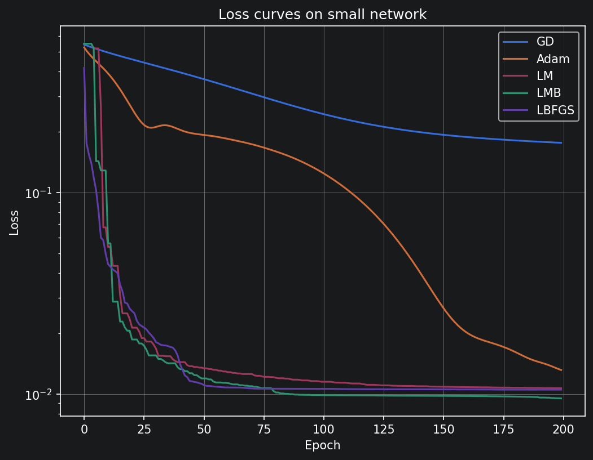
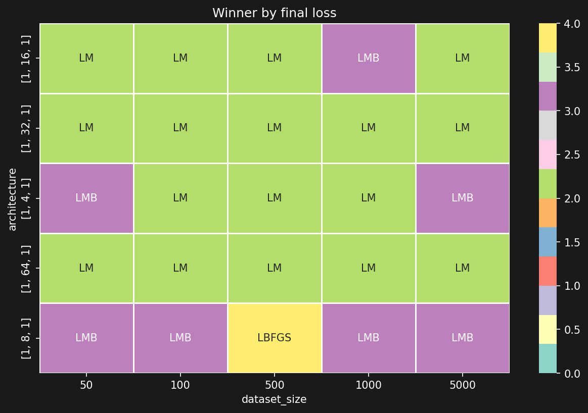
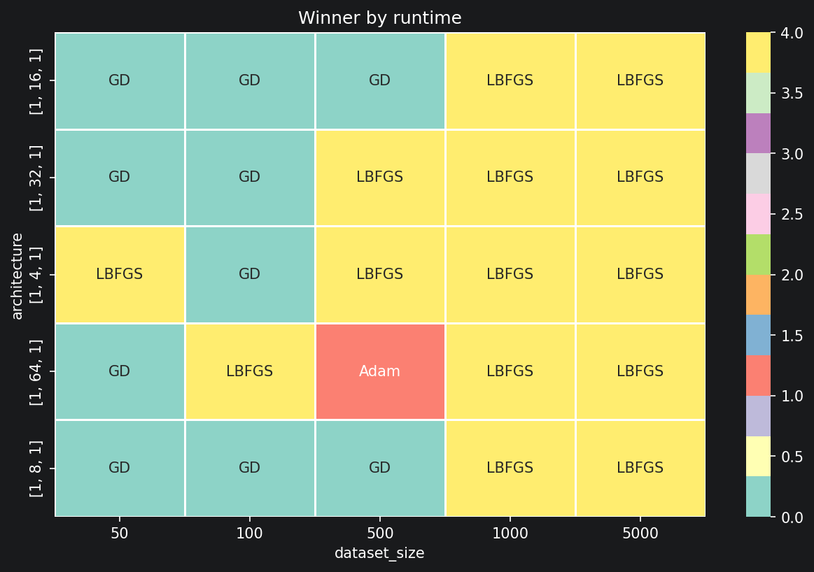
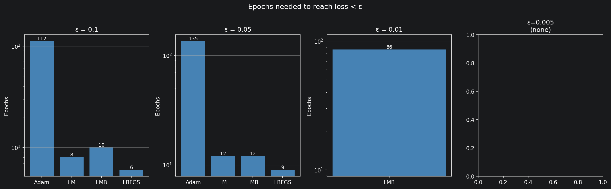

# When Does Second-Order Optimization Pay Off?
### Benchmarking Adam, L-BFGS, Levenberg-Marquardt, and LM-Broyden on Small Feedforward Networks

> A systematic study of first- and second-order optimization algorithms for training small neural networks, including an original modification of the Levenberg-Marquardt algorithm using Broyden's rank-1 Jacobian approximation.

---

## Motivation

Not all optimizers are created equal — and the best choice depends heavily on the problem scale.

Modern deep learning defaults to first-order methods like Adam, which scale effortlessly to millions of parameters. But for small networks — the kind used in scientific computing, physical system identification, and curve fitting — second-order methods that exploit curvature information can converge orders of magnitude faster.

**The central question of this project:**  
*At what point does the computational cost of second-order methods outweigh their convergence advantage?*

This project maps that boundary empirically, across network sizes and dataset scales, and proposes a modification to the Levenberg-Marquardt algorithm that improves its speed-accuracy trade-off.

---

## Algorithms

### Gradient Descent (GD) — baseline
The simplest first-order method. Updates parameters in the direction of the negative gradient:

```
θ ← θ - α · ∇L(θ)
```

Uses only the gradient — no curvature information. Implemented from scratch.

### Adam — modern first-order standard
Maintains exponential moving averages of gradients (`m`) and squared gradients (`v`), giving each parameter an adaptive learning rate:

```
m ← β₁·m + (1-β₁)·g
v ← β₂·v + (1-β₂)·g²
θ ← θ - α · m̂ / (√v̂ + ε)
```

Still first-order — does not use curvature. Scales to any network size. Implemented from scratch.

### Levenberg-Marquardt (LM) — second-order, explicit Jacobian
Solves a regularized linear system at each step using the full Jacobian matrix `J ∈ ℝ^(n_data × n_params)`:

```
(JᵀJ + λI) · Δθ = -Jᵀr
```

The damping factor `λ` interpolates between Gauss-Newton (λ→0, fast near solution) and gradient descent (λ→∞, stable far from solution). Implemented from scratch with numerical Jacobian.

### LM-Broyden — original contribution
A modification of LM that avoids recomputing the full Jacobian at every iteration. Instead, the Jacobian is updated using Broyden's rank-1 formula:

```
J_new = J_old + (Δr - J_old·Δθ) · ΔθᵀT / ||Δθ||²
```

where `Δθ = θ_new - θ_old` and `Δr = r_new - r_old`.

The full Jacobian is recomputed every `k=10` iterations and after 3 consecutive bad steps (steps that increase the loss), balancing approximation quality against computational cost.

### L-BFGS — second-order, approximate Hessian
Uses the last `k` gradient differences to implicitly approximate the inverse Hessian without ever storing it explicitly. Memory cost is `O(k·n_params)` instead of `O(n_params²)`.

Uses `scipy.optimize.minimize` with `method='L-BFGS-B'`. The decision not to implement from scratch was deliberate — L-BFGS requires a line search satisfying the Wolfe conditions alongside a two-loop recursion, adding significant implementation complexity with marginal research benefit given the scope of this project.

---

## Implementation Decisions

### Numerical vs. analytical Jacobian
LM and LM-Broyden use a numerical Jacobian computed by finite differences:

```python
J[:, j] = (f(θ + ε·eⱼ) - f(θ)) / ε
```

This requires `n_params` forward passes per Jacobian evaluation. An analytical Jacobian via backpropagation would be faster, but the numerical approach is architecture-agnostic — it works for any network without additional derivation. This is a conscious trade-off favoring generality over speed.

### LM-Broyden reset strategy
The Jacobian is reset to the numerical version when:
1. Every `k=10` iterations (periodic refresh)
2. After 3 consecutive steps that increase the loss (divergence detection)

Using `k=1` degenerates to LM-exact. Using `k=∞` with no divergence check risks accumulating approximation error. The choice of 3 consecutive bad steps before reset avoids unnecessary recomputation during early training (where occasional bad steps are normal) while protecting against sustained divergence.

### Controlled experiment design
All experiments use single-hidden-layer networks `[1, w, 1]` with varying width `w`. This isolates the effect of **parameter count** from the effect of **network depth**, ensuring that observed performance differences are attributable to a single variable. Depth as an additional factor is left for future work.

### Defining "winner"
Two separate criteria are used:
- **Accuracy winner**: lowest final loss after fixed epochs
- **Speed winner**: shortest wall-clock time

These are reported separately because they tell different stories. An algorithm can be accurate but slow (LM), fast but imprecise (GD), or a good compromise (LM-Broyden).

---

## Experimental Setup

**Task:** Approximate `y = sin(x) + 0.1·noise` on `x ∈ [-π, π]`

**Network architectures:**

| Label | Architecture | Parameters |
|-------|-------------|------------|
| XS    | [1, 4, 1]   | 13         |
| S     | [1, 8, 1]   | 25         |
| M     | [1, 16, 1]  | 49         |
| L     | [1, 32, 1]  | 97         |
| XL    | [1, 64, 1]  | 193        |

**Dataset sizes:** 50, 100, 500, 1000, 5000 samples

**Fair comparison:** All algorithms start from identical random initializations using a fixed seed.

---

## Results

### Loss curves — validation experiment



LM and LM-Broyden converge to lower loss in fewer epochs than Adam and GD on the small network. L-BFGS achieves competitive accuracy with the fewest iterations.

### Accuracy heatmap — who achieves lowest final loss?



**LM dominates accuracy across almost all configurations.** Second-order methods consistently outperform first-order methods in final precision on small networks.LM-Broyden occupies most remaining cells — faster than LM-exact while maintaining competitive accuracy.

### Speed heatmap — who is fastest?



**GD and L-BFGS dominate runtime.** GD because of its trivial per-step cost, L-BFGS because of scipy's highly optimized C implementation. 

### Runtime scaling with network width



LM and LM-Broyden scale poorly with network width — their runtime grows rapidly as `n_params` increases. Adam and GD remain nearly flat. The crossover point where LM-Broyden becomes slower than Adam occurs around width 32 (97 parameters).

### LM-Broyden vs. LM-exact trade-off

| Metric | Value |
|--------|-------|
| Average LM/LMB runtime ratio | > 1.0 (LMB is faster) |
| Average LMB/LM loss ratio | ≈ 1.0–1.5 (LMB slightly less accurate) |

LM-Broyden is consistently faster than LM-exact, at the cost of a small accuracy penalty. The trade-off is most favorable on larger networks where Jacobian recomputation is expensive.

---

## Analysis

### Why LM struggles on large networks
The Jacobian matrix `J` has shape `(n_data, n_params)`. Forming `JᵀJ` and solving the linear system scales as `O(n_params² · n_data)` and `O(n_params³)` respectively. For 193 parameters and 500 data points, this is already expensive. For millions of parameters, it is intractable.

### Why Adam scales
Adam stores only two vectors of size `n_params` — the moment estimates `m` and `v`. Per-step cost is `O(n_params)`. No matrix is ever formed or inverted.

### Why (JᵀJ + λI) and not just JᵀJ
`JᵀJ` can be singular or near-singular, making the system unsolvable. Adding `λI` to the diagonal guarantees positive definiteness and a unique solution. It also controls step size: large `λ` shrinks `Δθ` toward gradient descent, small `λ` allows Gauss-Newton steps.

### Why Broyden uses np.outer
Broyden's update must produce a matrix of shape `(n_data, n_params)` — the same shape as `J`. The correction term `(Δr - J·Δθ)` has shape `(n_data,)` and `Δθ` has shape `(n_params,)`. Their outer product gives exactly `(n_data, n_params)`. Standard matrix multiplication would fail due to incompatible dimensions.

---

## Limitations

- Single-hidden-layer networks only — depth effects not studied
- Single target function (sine) — generalization to other functions not verified
- Numerical Jacobian introduces approximation error of order `ε = 1e-5`
- LM-Broyden hyperparameters (`k=10`, 3 bad steps) chosen heuristically, not tuned

---

## Future Work

- **Analytical Jacobian via backpropagation** — eliminate the `n_params` forward passes per evaluation
- **Broyden reset threshold tuning** — systematic study of `k ∈ {1, 2, 5, 10, 20}` and bad-step thresholds
- **Multi-layer architectures** — isolate depth vs. width effects on optimizer performance
- **Additional target functions** — Gaussian, logistic curve, polynomial, to test generalization
- **Hybrid scheduler** — start with LM, switch to Adam when parameter count exceeds a threshold

---

## Project Structure

```
nn-optimizer-benchmark/
├── README.md
├── requirements.txt
├── src/
│   ├── network.py          # Layer and Network classes
│   ├── optimizers.py       # GD, Adam, LM, LM-Broyden, L-BFGS
│   └── experiments.py      # Benchmark runners
├── notebooks/
│   └── analysis.ipynb      # Visualizations and analysis
└── results/
    ├── figures/            # Saved plots
    └── data/               # Saved experiment results (JSON, CSV) ( future update )
```

---

## Installation

```bash
git clone https://github.com/manchiel/nn-optimizer-benchmark.git
cd nn-optimizer-benchmark
pip install -r requirements.txt
```

**requirements.txt:**
```
numpy
scipy
matplotlib
pandas
seaborn
jupyter
```

---

## Usage

```python
from src.network import Network, Layer
from src.optimizers import LevenbergMarquardt, LMBroyden, Adam
from src.experiments import run_validation, all_algos_on_all_datasets

# Quick validation
results = run_validation(epochs=200, arh=[1, 8, 1], n_samples=50)

# Full benchmark sweep
results_full = all_algos_on_all_datasets()
```

---

## References

- Levenberg, K. (1944). *A method for the solution of certain non-linear problems in least squares.*
- Marquardt, D. (1963). *An algorithm for least-squares estimation of nonlinear parameters.*
- Kingma, D., Ba, J. (2014). *Adam: A Method for Stochastic Optimization.* [arXiv:1412.6980](https://arxiv.org/abs/1412.6980)
- Nocedal, J., Wright, S. (2006). *Numerical Optimization*, Chapter 7. Springer.
- Broyden, C.G. (1965). *A class of methods for solving nonlinear simultaneous equations.*
- Ruder, S. (2016). *An overview of gradient descent optimization algorithms.* [ruder.io](https://www.ruder.io/optimizing-gradient-descent/)